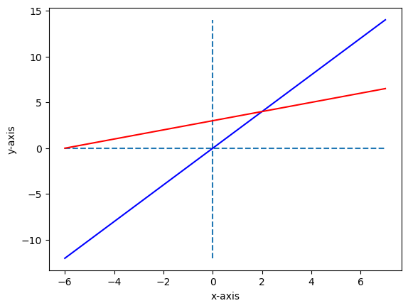
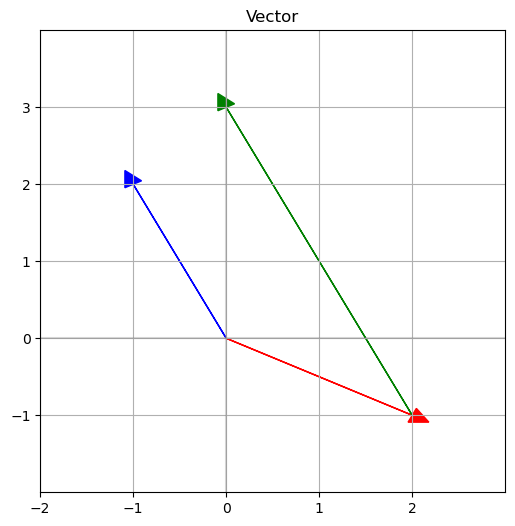
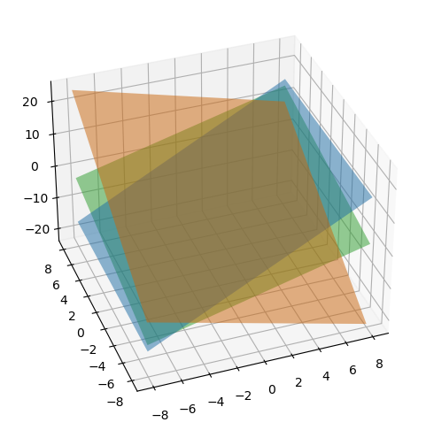
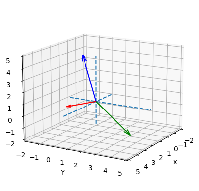

Lecture 1: The Geometry of Linear Equations
=======

 

## 0. Intro.
선형대수는 본질적으로 연립일차방정식의 Solution(해)를 구하는 학문이다.

일반적으로 연립방정식은 n개의 방정식에 n개의 변수가 주어지는데, 
연립일차방정식을 바라보는 관점(Picture)에 따라 수학적인 해석이 달라진다.
 
 

## 1. Row Picture

$$
2x - y = 0\\
-x + 2y = 3
$$

 
먼저 2개의 방정식과 2개의 변수가 있는 연립방정식을 Row Picture(행의 관점)으로 해석해보자.

 

    

    

행의 관점에서 주어진 연립방정식의 해는 두 직선의 교점으로 볼 수 있다.
  

## 2. Column Picture
Column Picture(열의 관점)에서는 어떠할까.

$$
x \left[\begin{matrix} 2 \\ -1\end{matrix}\right] + y \left[\begin{matrix} -1 \\ 2\end{matrix}\right]
= \left[\begin{matrix} 0 \\ 3\end{matrix}\right]
$$

 
Column Vector(열 벡터)로 표현된 연립방정식을 그래프로 나타내보자.

 
    

    

Column Picture(열의 관점)에서 연립방정식은 Column Vectors(열 벡터)의 Linear Combination(선형 결합)을 찾는 문제로 바뀐다.

 
아마 대부분의 사람들은 연립방정식을 Row Picture로 바라보는게 익숙할 것이다.

2차원에서는 2가지 관점 둘다 문제를 직관적으로 이해할 수 있지만, 차원이 커질수록 차이가 생기게 된다.
  

## 3. Row&Column Picture in 3-dim

$$
2x-y=0\\
-x+2y-z=-1\\
-3y+4z=4x
$$

위와 같이 3개의 방정식과 3개의 변수를 가진 일차연립방정식을 Row Picture로 해석해보자.

    

    

2차원과 다르게 3차원에서는 평면끼리의 intersection으로 바뀌었다.

Row Picture는 차원이 올라갈수록 연립방정식을 직관적으로 이해하기 힘들다.

특정 도형들의 intersection이라는 점은 변하지 않지만 머리 속으로 상황을 이미지화하는게 어렵기 때문이다.

  
이번에는 Column Picture로 연립방정식을 해석해보자.
 

$$
x\left[\begin{matrix} 2 \\ -1 \\0 \end{matrix}\right] + y\left[\begin{matrix} -1 \\ 2 \\-3\end{matrix}\right]
+z\left[\begin{matrix} 0 \\ -1 \\ 4\end{matrix}\right]= \left[\begin{matrix} 0 \\ -1 \\ 4\end{matrix}\right]
$$

 
3차원에서도 동일하게 Column Vectors의 Linear Combination을 찾는 문제로 이해할 수 있다.

 

    

    

벡터라는 도형의 특성상 비슷한 이미지로 떠올릴 수 있다.
  

## 4. Matrix Form

 

$$
x\left[\begin{matrix} 2 \\ -1 \\0 \end{matrix}\right] + y\left[\begin{matrix} -1 \\ 2 \\-3\end{matrix}\right]
+z\left[\begin{matrix} 0 \\ -1 \\ 4\end{matrix}\right]= \left[\begin{matrix} 0 \\ -1 \\ 4\end{matrix}\right]
\,\,\,\,\Longrightarrow \,\,\,\, AX = b\\ \, \\  \\A=\left[\begin{matrix} 2 && -1 && 0 \\ -1 && 2 && -1 \\ 0 && -3 && 4\end{matrix}\right]\,\,\,\,\,X=\left[\begin{matrix}x\\y\\z\end{matrix}\right]  \,\,\,\, \,\, b= \left[\begin{matrix}0\\-1\\4\end{matrix}\right]
$$

 

연립방정식을 다음과 같이 행렬식으로 나타냈을 때, 우변 b는 Column Vector들을 조합해서 만들어야 하는 목표 지점이 된다.

여기서 행렬 A는 그대로 두고, b의 값을 바꿔보자. 임의의 b에 대해 연립방정식 AX=b는 해를 가질까?

 

주어진 A에 대해서는 그렇다고 할 수 있다. A처럼 연립방정식의 계수로 만들어진 행렬을 계수 행렬이라고 하는데,

계수 행렬 A의 Column Vector들을 선형 결합해서 임의의 점 b를 표현할 수 있다면, 행렬 A는 Non-singular하다고 할 수 있다.

 

행렬 A가 임의의 b에 대해 해를 가지는 것과 Non-singular(=invertible)하다는게 무슨 의미이고 어떤 정보를 주는지 다음 수업들을 통해 알아보자.

